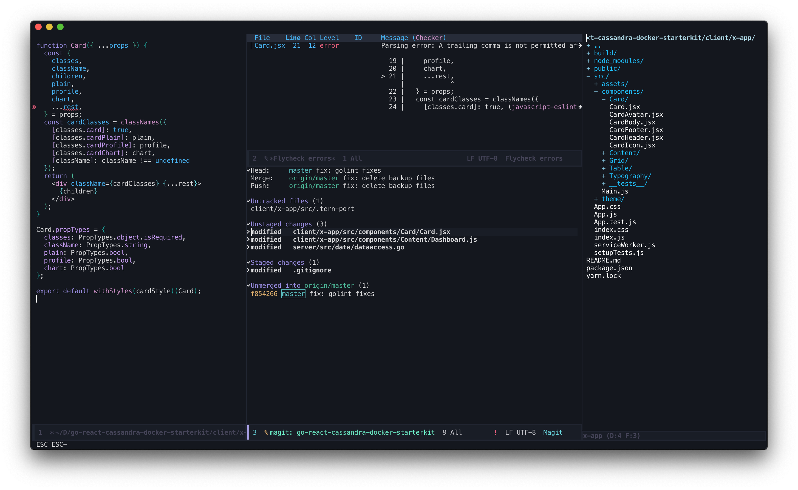

# This is a bleeding edge / draft copy - I am working on it(aka - take it with a pinch of salt)

# Art of software development in emacs




> Emacs running on OS X with react file being worked on, in left window, Flycheck buffer on second column top, Magit on bottom and neotree to the right.

> Main idea behing this customization is to stay minimalistic and responsive while providing rich funcationality - but nothing like form over function

These emacs customizations support following languages/ frameworks with all the goodies offered by emacs normally:

* Google Go

* Clojure & Elisp

* Javascript (specifically React, JSX & ES6)

* Linting for the above languages


## Emacs - Why is it still an enigma to most developers?

From Eric S. Raymond’s excellent book “The Art of Unix Programming”
> It is a common joke, both among fans and detractors of Emacs, to describe it as an operating system masquerading as an editor.

While it is true that learning curve to master emacs is steep, it is NOT a poor bet or an archaic editor by any means, in other words your emacs is as good as your configuration. It is infinitely configurable and you should know that it may take months to get to the flexibility you expect.

## Comparing it with new age editors

Here is the main difference I felt:


>Your ability to add features is NOT constrained excessively by the architecture, interfaces, class or file loading order etc. Customizations are NOT limited to the following: addinga a keyboard shortcut, changing syntax theme or performing an action while you save a file. Infact the above are easier to perform in Emacs than in VS Code or Atom. Normally, offering a simple functionality wont force you to write thousands lines of code.  Also you wont be asked to provide access to your contacts or be forced to upgrade computer to 16GB RAM or i7 processor.

Less bloated - in terms of architecture or hardware requirements. Emacs takes about 130 MB of memory in GUI mode after continuously using it for about a week with no restarts. If you use server / client mode the memory requirement will be far lesser.

### For the newbies

* emacs configuration needs programming effort - yes you will be writing code. If you are not ready to code it's better not to get into emacs. You will be using a language called `elisp`. The `elisp` language traces back its origins to `LISP` pogramming language from 1960s.

* Familirization with following terms will help immensely before venturing into emacs land

    * `modes` are a collection of tools to support a specific funcationality, language or a framework. In fact there are two types of modes active at any point of time -  mostly one major mode and multiple minor modes, for example, when editing `Javascript/NodeJS/JSX/React` the major mode will be `RJSX` and minor modes may be `yas snippets`, `fly check`, `company`, `tern` etc

    * `buffer` the text content which are being edited or getting viewed lives in a buffer. Normally if you open a file in emacs the buffer will have the same name as the file name. To see all the buffers in emacs you use the keyboard shortcut `C-x C-b`, where `C` is the Control key and to switch to a buffer to edit or view a file you are interested in, use `C-x b`. You can view the name of the currently buffer in area know as `modeline` which is descibed below.

    * `modeline` - appears at the bottom of the window, which describes what is going on in the current buffer.
    * `window & frame` - a window belongs to exactly one frame. There can be many windows in a frame. Also at any point you can have one or more frames running. Confused ? worry not - when starting emacs, you may be seeing only one window (that holds the current buffer) and one frame.  Lets say you want to see or edit a `golang` source file on the right side and the corresponding test file on the left side, then what you have is two windows side by side in a single frame. You can use `C-x 3` to split the current window into two where both will be showing the same buffer being worked on. Use `C-x o` to switch between windows


    * `minibuffer` - this is the place from where emacs (editor basically driven by keyboard), reads names, commands or expressions.

    * `scatcheditor` - Coming soon

    * `incremental completion and project` - Coming soon

    * `selectionema tree / explorer` - Coming soon

    * `gui mode or client / server mode` - Coming soon

## Configuration Structure - Quick Look

> Spoiler alert: My primary machine is a Mac Book Pro and I haven't tried any of these config in Windows or Linux.

My favourite monotype fonts are `Operator Mono` (expensive), `Roboto Mono` (powerline / patched font) and `SF Mono`.


The startup file `init.el` is tasked with the basic funcationalities such as checking emacs `min version`, `gc threshhold` and downloading packages from internet and to show an error when something goes wrong - I admit that sometimes seeing errors can be very distracting.

```eslisp
(setq debug-on-error t)
```

Commenting the above line in `init.el` - wont report any errors.


All customizations for modes live in `.emacs.d/customization` folder. The customization for `golang` is in `setup-go.el` file and same for `Javascript/NodeJS/JSX/React` are in `setup-js.el` file.
